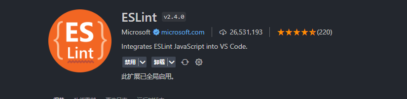
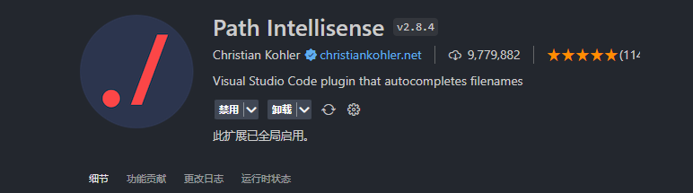
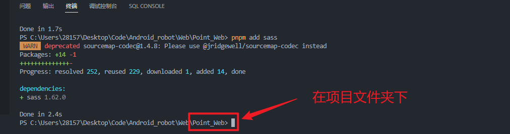

# 项目概览

## 技术栈

+ Vue - 网页框架
+ SCSS - CSS超集，兼容CSS，提供更多功能。
+ Node - 后端服务器

## 工具

+ Vue cli - 构建工具，主要功能为页面的热重载（类似Live Server）和打包
+ ESLint - 代码规范化工具
+ 

# 项目配置

## 项目环境

### Node
>
> 基础的`JavaScript`运行环境

+ 目前使用版本为[Node v18.16.0 LTS](https://nodejs.org/dist/v18.16.0/node-v18.16.0-x64.msi)
+ 请先一路确认安装Node

+ ```shell
  node -v # 查看是否安装成功并查看版本号
  ```

### npm
>
> npm为Node下的包管理软件

+ 在Node安装完成后打开命令提示符，执行以下命令

+ ``` shell
  npm -v # 检查npm是否正常安装
  npm config set registry https://registry.npmmirror.com/ # 设置国内镜像源
  npm i -g yarn # 安装进阶包管理工具 yarn
  
  ```

## VSCode 插件

> 笔者习惯使用 VS Code 编写页面代码，下面为 VS Code 的插件配置

### ESLint
>
> 提供代码规范检查和自动修改

+ 

+ 安装完成后按`Ctrl+Shift+P`输入`setting.json`打开用户配置,并在文件中添加

+ ```json
  {
    ...
    ...
    // 保存后自动修复格式来自 ESLint
    "eslint.format.enable": true,
    "editor.codeActionsOnSave": {
        "source.fixAll.eslint": true
    },
    // 添加vue支持  
    "eslint.validate": [
        "javascript",
        "javascriptreact",
        "vue",
    ],
  }
  ```

### Volar

> Vue官方出品，提供`Vue`语言特性，如语法识别、代码格式化

+ 

+ 安装完成后在`setting.json`配置文件中添加配置

+ ```json
  {
    ...
    ...
    // 将 vue 文件的默认代码格式化工具设为 volar
    "[vue]": { 
        "editor.defaultFormatter": "Vue.volar"
    },
  }
  ```

### Vue 3 Snippets

> 提供Vue代码补全

+ 

### SCSS

> 提供Sass(Scss)语言特性

+ 

### Path Intellisense

> 我们知道，`Vue cli`构建工具提供了路径别名的功能。一般会将`@`符号设为`src`目录的别名，这样就不用使用`../`返回上级目录了，所有需要引入的文件都用`@/...`从上至下引入。
> 为了VS Code也能识别路径别名`@`，于是安装本插件

+ 

+ 安装完成后在`setting.json`配置文件中添加配置

+ ```json
  {
      ...
      ...
       // 关了 js 和 ts 的原生代码路径提示，使用 path intellisense 插件
      "typescript.suggest.paths": false,
      "javascript.suggest.paths": false,
      "path-intellisense.extensionOnImport": true,
      "path-intellisense.mappings": {
          "@": "${workspaceFolder}/src",
      },
  }
  ```

# 项目拉取


# 项目运行

+ 以项目文件夹作为工作文件夹打开，即直接在VS Code中`打开文件夹`，然后选项目的文件夹。

+ `Ctrl+ ~`调出终端。保证路径为项目文件夹下。如下图所示。

+  

+ 使用下面的命令。先安装包，然后起调试服务器。

+ ```shell
  yarn intall # 安装所有依赖包
  yarn serve # 开启调试服务器，在浏览器中输入网址即可实时查看代码效果
  yarn build # 打包到项目的dist目录下
  ```

